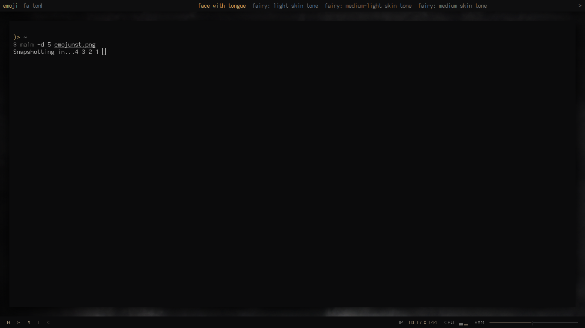

# Emojenu

A [Dmenu](https://tools.suckless.org/dmenu) emoji selector.

## Installation

```bash
# Clone the repo
git clone https://github.com/lyneca/emojenu

# Generate emoji list (to ~/.config/emoji)
python3 generate.py

# Link emojenu to somewhere on $PATH.
ln -s $PWD/emojenu ~/.local/bin/emojenu
```

`emoji-test.txt` is taken from https://unicode.org/Public/emoji/11.0/.

## Usage

Bind `emojenu` to a button on your keyboard, and emoji away! Once selected,
the emoji will be copied to your clipboard using `xclip -selection clipboard`.

## Screenshot


